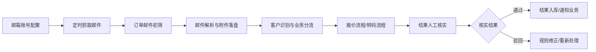

# 邮件抓取任务化流程方案

- 状态：方案评审中
- 日期：2026-08-07
- 范围：仅方案设计，未进入开发

## 1. 背景与目标

营管业务各电脑邮箱中会收到客户订单类邮件，目前依赖人工查看邮件后再进行报价或转码处理。本方案通过 IMAP 集中抓取订单类邮件，自动识别客户与业务类型，接入现有报价/转码流程，产出结果后由业务人工核实。

目标：

- 订单类邮件集中进入平台，不依赖人工搬运。
- 自动识别客户、订单内容与业务类型（报价/转码）。
- 复用现有报价、转码流程，自动化执行。
- 结果必须经过人工核实后才算有效。

非目标：

- 不做通用邮件客户端，业务日常查看邮件仍在原邮箱。
- 不处理与订单无关的邮件。
- 本阶段不实现自动执行，先以人工确认为主。

## 2. 总体流程



各环节说明：

1. 邮箱接入：管理员配置邮箱账号，包括 IMAP 服务器、端口、加密授权码、启用状态、抓取间隔。
2. 定时抓取：按账号轮询，使用 `UIDVALIDITY + UID` 增量抓取，避免重复。
3. 订单初筛：按发件人白名单、客户域名、主题关键词、附件类型判断是否为订单邮件。
4. 邮件解析：提取发件人、主题、时间、正文、客户信息，附件落盘并计算 SHA256。
5. 业务分流：按客户规则、附件类型、主题判断应进入报价还是转码流程，无法判断时进入待确认。
6. 自动化执行：复用现有报价/转码流程，把解析出的订单内容喂入执行。
7. 人工核实：结果进入核实列表，业务确认通过或驳回。
8. 规则沉淀：确认通过的案例可沉淀为客户规则，走现有规则维护体系。

## 3. 角色与页面

角色：

- 管理员：维护邮箱账号、订单识别规则、抓取状态。
- 业务：确认任务、核实结果、驳回并反馈原因。

页面规划：

| 页面 | 主要功能 |
| --- | --- |
| 邮箱接入管理 | 账号列表、启用/停用、上次抓取时间、手动触发、授权码失效告警 |
| 待处理任务 | 来源邮件、客户、识别出的订单内容、建议动作（报价/转码）、确认执行 |
| 结果核实 | 报价结果或转码结果，通过/驳回，驳回填写原因 |
| 处理记录 | 抓取失败、解析失败、执行失败、重复邮件过滤记录 |

## 4. 数据设计

核心表：

| 表 | 说明 |
| --- | --- |
| `mail_accounts` | 邮箱账号、IMAP 配置、加密授权码、抓取间隔、状态 |
| `mail_messages` | 邮件元数据：主题、发件人、时间、正文、UID、Message-ID |
| `mail_attachments` | 附件名、类型、大小、SHA256、磁盘路径 |
| `mail_tasks` | 来源邮件、客户、业务类型（报价/转码）、状态、结果引用 |
| `mail_rules` | 订单识别和分流规则，支持页面维护 |
| `mail_logs` | 抓取、解析、执行日志，供排查 |

附件文件存放：

```text
storage/mail_attachments/<账号ID>/<邮件ID>/<文件名>
```

## 5. 任务状态机

| 状态 | 含义 |
| --- | --- |
| 待确认 | 疑似订单邮件，等待业务确认是否执行 |
| 待执行 | 已确认进入报价/转码 |
| 执行中 | 流程运行中 |
| 待核实 | 结果已产出，等待人工核实 |
| 已通过 | 核实通过，结果有效 |
| 已驳回 | 结果错误或邮件非订单，可触发规则修正 |
| 异常 | 抓取失败、解析失败、执行失败，需人工处理 |

## 6. 关键技术要求

IMAP 接入：

- 个人 163 邮箱：`imap.163.com:993`，SSL。
- 网易企业邮箱：`imap.qiye.163.com:993`，SSL，账号需为完整邮箱地址。
- 使用客户端授权码登录，不用网页登录密码。
- 登录后必须发送 `ID` 命令声明客户端身份，否则网易返回 `Unsafe Login`。
- 网易 IMAP 默认只同步最近 30 天邮件；如需全量，需在网页邮箱设置中改为“收取全部邮件”。

抓取与存储：

- 增量抓取：`UIDVALIDITY + UID`。
- 去重：`Message-ID + 附件 SHA256`。
- 授权码加密存储，禁止明文。
- 附件路径防穿越，按账号/邮件隔离。

调度与限流：

- 单个邮箱并发 1，整体并发 3 到 5。
- 抓取间隔按账号配置，避免高频触发网易限流。
- 失败重试、超时处理、授权码失效告警。

## 7. 风险与应对

| 风险 | 应对 |
| --- | --- |
| 订单邮件识别漏抓/误抓 | 先人工确认后执行，规则跑稳后再考虑自动执行 |
| 订单格式不统一 | 复用现有转码解析能力，按客户维护解析模板 |
| 重复邮件 | 按 `Message-ID + 附件 SHA256` 去重 |
| 授权码失效 | 抓取失败告警并暂停该邮箱，不静默失败 |
| 30 天邮件限制 | 先按最近 30 天，上线平稳后可切换收取全部邮件 |
| 隐私与安全 | 授权码加密存储、权限限制、只处理规则命中的邮件 |

## 8. 分阶段实施计划

| 阶段 | 内容 | 完成标志 |
| --- | --- | --- |
| 阶段 A | 接入试点邮箱，完成抓取、初筛、解析、待确认列表 | 试点邮件可进入待确认任务 |
| 阶段 B | 打通报价/转码执行，结果进入人工核实 | 报价/转码结果可核实通过/驳回 |
| 阶段 C | 多邮箱接入、规则页面维护、告警、日志审计 | 管理员可自助维护账号与规则 |
| 阶段 D | 业务跑稳后，可选开启全自动执行模式 | 自动执行 + 结果核实闭环 |

## 9. 待确认决策

- 试点使用哪个客户邮箱和哪类真实订单邮件。
- 报价/转码分流依据：发件人、主题、附件格式，还是客户特殊规则。
- 识别后默认人工确认再执行，还是自动执行加结果核实。
- 非订单邮件是否留日志但不建任务。
- 核实通过后是否自动沉淀为客户规则。

## 10. 验证记录

2026-08-07：

- 已使用试点授权码验证 `imap.163.com` 登录成功。
- 已确认网易要求发送 `ID` 命令后才能读取文件夹。
- 已验证可读取收件箱邮件，并解析主题、发件人、正文、附件。
- 已确认网易 IMAP 默认只同步最近 30 天邮件。
