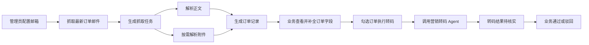

# 邮件自动化转码 Agent 功能说明与验收基线

- 文档状态：已接入，待业务验收
- 版本：v1.1
- 更新日期：2026-08-11
- 适用模块：邮件自动化转码 Agent
- 页面入口：功能中心 -> 邮件自动化转码 Agent

## 1. 功能定位

邮件自动化转码 Agent 用于减少业务人员从订单邮件中复制信息的工作量。它负责抓取订单邮件、提取订单字段、保留邮件与附件来源，并将经人工核实的客户规格交给现有营销转码 Agent 处理。

本模块不是新的转码规则引擎，也不维护胶系、厚度、尺寸或客户特殊规则。所有转码判断均复用营销转码 Agent 的现有规则、评分和客户特殊规则。

业务流程：

## 2. 本期边界

### 已支持

- 手动抓取邮箱中昨天和今天被初步识别为订单的邮件。
- 一次抓取生成一个抓取任务；一封邮件下可生成多条订单记录。
- 提取邮件正文中的客户名称、客户规格、订单备注、订单号。
- 解析真实附件中的 Excel、PDF 和图片；正文内嵌图片只保存备查，不参与解析。
- 保留原始 EML、附件文件、抓取时间、抓取人、字段编辑记录和转码结果。
- 业务补全订单字段后，可勾选多条订单执行营销转码 Agent。
- 转码后业务可逐条通过或驳回结果。

### 本期不做

- 不做定时抓取和邮件收发；仍以原邮箱为日常邮件客户端。
- 不复制或单独维护营销转码规则。
- 不自动把邮件解析结果当作最终正确订单。
- 不把转码结果直接回写 APS、订单系统或报价模块。
- 不处理正文内嵌图片的订单识别。

## 3. 页面与操作说明

### 3.1 邮件自动化转码 Agent 首页

入口：功能中心 -> 邮件自动化转码 Agent。

页面展示邮箱账号数量、最近抓取任务和最近转码任务，并提供以下入口：

| 操作 | 用途 |
| --- | --- |
| 抓取订单邮件 | 从选定启用邮箱中读取昨天和今天的订单类邮件 |
| 邮箱配置 | 管理员维护 IMAP 邮箱、端口、客户端授权码和启用状态 |
| 抓取任务 | 查看每次抓取到的邮件和订单明细 |
| 转码任务 | 查看每次调用营销转码 Agent 的结果与核实状态 |

### 3.2 邮箱配置

管理员维护以下信息：邮箱地址、IMAP 服务器、端口、客户端授权码、启用状态。

- 个人 163 邮箱默认 `imap.163.com:993`。
- 企业邮箱可按实际邮箱服务商填写服务器和端口。
- 页面仅接受授权码输入，不展示已保存的授权码明文。
- 账号启用后，首页可选择其作为抓取目标。

### 3.3 抓取任务

一次“抓取最新订单邮件”对应一条抓取任务。列表按时间展示抓取人、邮件数、订单数、执行状态和说明；进入任务后，可查看本次抓到的邮件。

订单邮件当前使用初步筛选：主题或发件人命中订单相关线索后才进入任务。该筛选只是减少无关邮件，不代表订单字段已经准确。

### 3.4 邮件订单明细

每封邮件单独展示其下订单记录，避免把所有订单堆在同一个页面。

订单明细展示：客户、订单号、客户规格、字段状态、转码状态和“查看/编辑”入口。

- 字段不完整：需要进入单条订单页面补充。
- 已核实且未执行转码：可勾选后批量调用营销转码 Agent。
- 已生成转码结果：进入转码任务页核实。

### 3.5 单条订单编辑

业务可查看并修改：客户代码、客户名称、订单号、客户规格、订单备注。

页面同时展示邮件来源、附件列表、附件解析状态，以及已有转码结果的码值、置信度和说明。附件可按需重新解析，解析后的有效规格会合并为该邮件下的订单记录。

### 3.6 转码任务与结果核实

每次批量执行生成一个转码任务。任务详情逐条展示客户、规格、转码码值、置信度、状态与说明。

| 结果状态 | 业务动作 |
| --- | --- |
| 待核实 | 业务核对码值后选择“通过”或“驳回” |
| 已通过 | 本次转码结果确认可用 |
| 已驳回 | 回到订单字段修正后重新执行转码 |
| 失败 | 查看说明，补充字段或修正规格后重试 |

## 4. 字段来源与人工核实

| 字段 | 初始来源 | 业务处理方式 |
| --- | --- | --- |
| 客户代码 | 由客户名称匹配已有客户资料，或人工填写 | 无法匹配时人工补充 |
| 客户名称 | 邮件正文、附件或人工填写 | 应与营销转码 Agent 的客户名称一致 |
| 客户规格 | 邮件正文、Excel、PDF、图片或人工填写 | 必须核对为可转码的客户规格 |
| 订单备注 | 正文或附件备注列 | 保留给营销转码 Agent 的订单备注语义规则 |
| 订单号 | 正文或附件 | 用于业务追溯，不参与营销转码编码 |

当前系统以“客户名称和客户规格已填写”作为可进入转码的字段完整性判断；客户代码为空时会尝试根据客户名称匹配。业务验收阶段应重点确认：是否需要改为“客户代码、客户名称、客户规格三项均由人工确认后才能转码”。

## 5. 与营销转码 Agent 的关系

邮件模块仅组装下列输入，再调用营销转码 Agent 的核心服务：

| 输入字段 | 对应营销转码字段 |
| --- | --- |
| 客户代码 | customer_code |
| 客户名称 | customer |
| 客户规格 | spec |
| 订单备注 | order_remark |

营销转码 Agent 负责：基础规则、客户特殊规则、订单备注语义标准化、100 分正式出码门禁、待人工确认码值和字段证据。邮件模块不新增或覆盖这些规则。

营销转码 Agent 返回“成功”或“待确认”且有码值时，邮件订单进入“待核实”；返回失败时，邮件订单记录失败原因。邮件模块的“通过/驳回”只影响本条邮件订单的使用状态，不会自动新增长期转码规则。

## 6. 数据留存与追溯

| 数据 | 留存用途 |
| --- | --- |
| 邮箱账号配置 | 保存 IMAP 连接信息和启用状态 |
| 原始 EML | 邮件原文追溯 |
| 真实附件与内嵌图 | 附件来源追溯；内嵌图仅备查 |
| 抓取任务与日志 | 追溯何时、由谁抓取及抓取结果 |
| 订单记录 | 追溯提取字段、人工补充字段、来源类型和转码状态 |
| 转码任务 | 追溯批次、执行人、成功/失败数量和结果核实状态 |

当前邮件去重以“邮箱账号 + INBOX + UID”为主。同一邮件重复抓取不会重复生成邮件记录，但后续可补充 Message-ID、附件摘要等更严格的去重校验。

## 7. 权限与安全基线

目标权限口径：

| 角色 | 权限 |
| --- | --- |
| 管理员 | 邮箱配置、授权码维护、手动抓取、查看抓取日志 |
| 业务用户 | 查看订单、补充字段、执行转码、核实转码结果 |

当前实现已限制邮箱配置为管理员；手动抓取入口仍需补充同样的管理员校验。授权码使用 Fernet 密文保存，正式环境必须配置 `MAIL_MASTER_KEY`，不得依赖开发回退密钥。生产环境 IMAP 必须启用服务器证书校验。

## 8. 当前验收与待补强项

### 已完成实现

- 独立 Blueprint：`/mail-transcode`。
- 独立邮件、附件、订单、抓取任务和转码任务数据表。
- HTML 繁转简、订单号/客户/规格/备注初步提取。
- Excel 直接解析；PDF、图片复用现有采购订单解析能力。
- 调用既有营销转码 Agent 核心服务，不复制规则。
- 页面支持抓取任务、订单字段编辑、附件解析、转码执行和结果通过/驳回。

### 上线前待补强

1. 手动抓取接口增加管理员权限校验。
2. 邮箱更新时授权码留空应保留原值，不能覆盖为空。
3. 明确“字段完整”与“人工确认”的状态边界，避免仅因字段齐全就直接进入转码。
4. 正式环境强制配置 `MAIL_MASTER_KEY` 并启用 IMAP 证书校验。
5. 收紧订单邮件初筛关键词，避免 `PO`、`GA` 等过宽匹配。
6. 新增邮件解析、权限、字段状态、转码调用及结果核实的自动化测试。

## 9. 代码与页面位置

| 内容 | 位置 |
| --- | --- |
| 模块路由 | `fangzheng_web_app/mail_transcode_agent/routes.py` |
| IMAP 抓取 | `fangzheng_web_app/mail_transcode_agent/mail_fetch_service.py` |
| 正文解析 | `fangzheng_web_app/mail_transcode_agent/mail_html_parser.py` |
| 附件解析与转码调用 | `fangzheng_web_app/mail_transcode_agent/mail_order_service.py` |
| 邮件数据存取 | `fangzheng_web_app/mail_transcode_agent/mail_store.py` |
| 邮箱授权码加密 | `fangzheng_web_app/mail_transcode_agent/mail_crypto.py` |
| 页面模板 | `templates/mail_transcode_agent/` |
