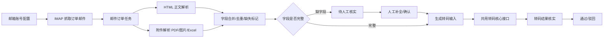

# 邮件自动化转码Agent 开发方案

- 状态：待业务/技术确认
- 版本：v0.1
- 日期：2026-08-10
- 关联文档：`docs/features/邮件抓取任务化流程方案.md`

## 1. 背景与目标

营管业务邮箱中会收到客户订单邮件，目前需要人工查看邮件、提取订单信息后再转码。本模块目标是把“订单邮件 -> 转码结果”的流程自动化，并保留人工核实环节。

目标：

- 抓取订单类邮件，当前阶段简化处理：只抓取邮箱最新的 5 封订单邮件。
- 从邮件 HTML 正文和附件（PDF/图片/Excel）中提取客户名称、客户规格、订单备注等字段。
- 字段缺失的记录标记为“待人工核实”，由业务补全后再进入转码。
- 复用现有营销转码 Agent 核心出码接口，产出结果后人工核实。

边界：

- 不改动现有营销转码 Agent 页面、任务逻辑和核心接口行为。
- 新模块独立入口、独立页面、独立任务数据。
- 订单初筛规则本期不开发，后续单独优化。

## 2. 总体架构



## 3. 模块拆分与代码位置

新模块建议放在 `fangzheng_web_app/mail_transcode_agent/`，与现有 `transcode_agent_*` 文件隔离。

建议文件：

| 文件 | 职责 |
| --- | --- |
| `mail_account_service.py` | 邮箱账号配置、授权码加密存储、启用/停用 |
| `mail_fetch_service.py` | IMAP 抓取、增量同步、邮件元数据与附件落盘 |
| `mail_html_parser.py` | HTML 正文解析、最新订单段截取、繁转简、编码统一 |
| `mail_attachment_service.py` | 附件提取、调用现有 PDF/图片转Excel 能力 |
| `mail_order_extractor.py` | 字段合并、去重、缺失标记、生成转码输入 |
| `mail_transcode_agent_service.py` | 调用共用转码核心接口、任务状态管理 |
| `routes.py` | 新模块路由 |
| `templates/mail_transcode_agent/*.html` | 新模块页面 |

复用但不修改：

- `transcode_agent_service.calculate_transcode_agent_quote`：转码核心出码接口。
- `transcode_agent_engine`：规则引擎、基础规则、客户特殊规则、语义规则。
- `pdf_excel_service`：PDF/图片转 Excel 解析能力。
- 现有营销转码 Agent 页面、任务表、确认中心逻辑保持不变。

## 4. 数据模型

新增表：

| 表 | 字段要点 |
| --- | --- |
| `mail_accounts` | id、邮箱地址、imap_host、imap_port、授权码密文、启用状态、抓取间隔、上次抓取时间/状态 |
| `mail_messages` | id、account_id、folder、UID、Message-ID、主题、发件人、时间、HTML正文、文本正文；`(account_id, folder, UID)` 唯一 |
| `mail_attachments` | id、mail_id、文件名、类型、大小、SHA256、磁盘路径、是否内嵌图 |
| `mail_order_tasks` | id、mail_id、客户代码、客户简称、客户规格、订单备注、订单号、来源类型、字段完整性、核实状态、核实人/时间 |
| `mail_transcode_jobs` | id、task_ids、输入文件路径、转码任务状态、结果引用 |
| `mail_fetch_logs` | id、account_id、开始/结束时间、状态、错误信息 |

附件落盘路径：

```text
storage/mail_transcode/<account_id>/<mail_id>/attachments/
storage/mail_transcode/<account_id>/<mail_id>/inline_images/
```

## 5. 接口设计

### 5.1 内部服务接口

- `fetch_latest_order_mails(account_id)`：IMAP 手动抓取昨天和今天的订单邮件，入库。
- `parse_mail_to_order_task(mail_id)`：解析 HTML/附件，生成 `mail_order_tasks`。
- `build_transcode_input(task_ids)`：生成转码输入文件。
- `run_mail_transcode(task_ids)`：调用共用转码核心接口。
- `review_mail_order_task(task_id, fields)`：业务补全字段。

### 5.2 HTTP 接口

| 方法 | 路径 | 说明 |
| --- | --- | --- |
| GET | `/mail-transcode/accounts` | 邮箱账号列表 |
| POST | `/mail-transcode/accounts` | 新增/更新邮箱账号 |
| POST | `/mail-transcode/fetch` | 手动触发抓取最新订单邮件 |
| GET | `/mail-transcode/orders` | 邮件订单任务列表 |
| GET | `/mail-transcode/orders/<id>` | 单条订单详情 |
| POST | `/mail-transcode/orders/<id>/review` | 补全字段/标记已核实 |
| POST | `/mail-transcode/run` | 生成转码输入并执行转码 |
| GET | `/mail-transcode/jobs/<id>` | 转码任务状态与结果 |

### 5.3 共用转码核心接口

新模块只负责组装输入，调用现有转码核心接口，不改其行为：

```text
输入：客户代码、客户简称、客户规格、订单备注
输出：出码结果、置信度、状态（成功/待确认/失败）
```

## 6. 页面设计

在现有“营销转码Agent”导航分组下新增二级入口“邮件自动化转码Agent”。

页面清单：

| 页面 | 功能 |
| --- | --- |
| 邮箱抓取配置 | 管理员维护邮箱账号、授权码、抓取状态；手动触发抓取 |
| 邮件订单提取 | 展示邮件列表和提取字段：客户名称、客户规格、订单备注、订单号、来源 |
| 待人工核实 | 展示缺字段记录，支持补全/修正后进入转码 |
| 转码结果核实 | 独立页面，展示转码结果，支持通过/驳回；不复用现有确认中心页面 |

现有页面改动：

- `base.html`：导航分组下新增“邮件自动化转码Agent”入口。
- `dashboard.html`：可选，增加邮件订单待处理数量。
- 现有 `transcode_agent.html`、确认中心页面不改。

## 7. 核心流程细节

### 7.1 IMAP 抓取

- 个人 163 邮箱：`imap.163.com:993`，SSL。
- 网易企业邮箱：`imap.qiye.163.com:993`，SSL。
- 登录：邮箱地址 + 客户端授权码；登录后发送 `ID` 命令。
- 增量抓取：`UIDVALIDITY + UID`。
- 去重：`Message-ID + 附件 SHA256`。
- 当前阶段：仅手动触发，抓取昨天和今天的订单邮件；试点邮箱账号在页面配置，不写死在代码中。

### 7.2 HTML 正文解析

- 统一转 UTF-8，繁转简（参考 `zhconv`）。
- 截取最新订单段：以“发件人/发送时间/主题”等转发标记切分，取最新一段。
- 提取字段：客户名称、客户规格、订单备注、订单号。
- 提取方式：HTML 表格解析 + 文本规则；解析不出则标缺失。

### 7.3 附件解析

- 只处理 `Content-Disposition: attachment` 的真实附件。
- PDF/图片：复用现有 `pdf_excel_service`，从解析 JSON 中取 `物料编码/名称规格/数量/单价`。
- Excel：本期保留原始文件，暂不自动解析。
- 正文内嵌图：保留在 `inline_images/`，不参与订单字段提取，备查。

### 7.4 字段合并与缺失标记

- 合并维度：订单号 + 客户产品编号 + Message-ID。
- 优先级：附件“名称规格” > HTML 表格规格；附件客户 > HTML 客户。
- 任一关键字段缺失（客户代码、客户规格），订单标记为“待人工核实”，不自动进入转码。

### 7.5 转码执行与核实

- 生成输入文件：`客户代码、客户简称、客户规格、订单备注`。
- 本期转码输入仅保留转码四列，不保留报价字段（数量、单价、订单号等）。
- 调用共用转码核心接口逐行出码。
- 结果进入新模块“转码结果核实”页面。
- 通过：结果入库并通知；驳回：业务修正字段后重跑。

## 8. 权限与安全

- 管理员：邮箱账号配置、授权码维护。
- 业务：邮件订单查看、字段补全、结果核实。
- 授权码使用 Fernet 加密存储，密钥放环境变量，页面不展示明文。
- 邮件抓取、解析、转码关键操作记录审计日志。

## 9. 分阶段开发计划

| 阶段 | 内容 | 验收标准 |
| --- | --- | --- |
| 阶段 A | 数据表、邮箱配置、IMAP 抓取、邮件列表 | 可手动抓取昨天和今天的订单邮件并展示 |
| 阶段 B | HTML 解析、附件解析、字段合并、待人工核实 | 5 封样例邮件可生成订单任务，缺字段正确标记 |
| 阶段 C | 转码输入生成、共用核心接口调用、结果核实 | 完整字段订单可出码，结果可核实通过/驳回 |
| 阶段 D | 导航、权限、日志、批量核实、规则沉淀 | 业务可完整走通闭环 |

## 10. 测试与验收

使用已归档样例：

- 景旺电子：PDF 订单。
- 赣州逸豪：图片订单（正文内嵌图）。
- 超跃科技：PDF + XLSX 订单。
- 奥士康：正文订单。
- 超颖电子：正文样品需求。

验收要求：

- 每封样例邮件都能生成 `mail_order_tasks`。
- 缺字段记录状态为“待人工核实”。
- 补全后能生成转码输入并调用核心接口出码。
- 现有营销转码 Agent 页面和功能回归无变化。

## 11. 已确认决策

- 试点邮箱：暂时使用开发者的个人 163 邮箱，后续替换为业务邮箱；账号由管理员在页面配置，授权码不写死在代码和文档中。
- 结果核实页面：独立实现，不复用现有确认中心页面。
- 转码输入：本期仅保留转码字段（客户代码、客户简称、客户规格、订单备注），不保留报价字段。
- 抓取方式：本期先只支持手动触发，不做定时抓取。
